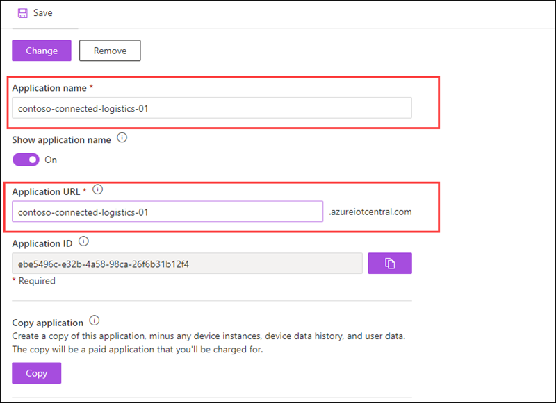

# Exercise 2: Customizing IoT Central Application

## Overview

This exercise will cover how to add custom branding and operator resources to an Azure IoT Central application with white labeling options for a better visual fit with an organization’s other applications

### Task 1: Customize Azure IoT Central UI 

In this task, you will learn how to customize your Application name, URL, Application logo, browser icon, and add help links for the organization's branding. 

1. To create a custom theme, on your connected logistics application page from the left-hand menu under **App setting** click on **Administration**.

    

1. In the **App settings** page select **Your Application**. 

    

1. To customize your application name, under **Application Name** update the name of your application. For now update it to **contoso-connected-logistics-DeploymentID**, find the DeploymentID from the Lab Environment tab.

1. Under **Application URL** you can update the URL of your application. When you change your URL, the old URL will no longer work, and you need to notify your users about the new URL to use. For now, update it to **contoso-connected-logistics-DeploymentID**.
 
    
  
1. To customize your application image click on change under **Application image**, in the Open dialog box, browse to **C:\AllFiles\IoT-Central-AIW-main\Labfiles\images** folder, and select app.png, and click on **Open**. This image appears on the application tile in the **My Apps** page of the **IoT Central** application manager.

    

1. Select **Save**, if prompted to confirm click on **Ok**.

1. To verify changes in your application from the left navigation menu click on the **Azure IoT Central** icon. 

   

1. In **Azure IoT Central** page from the left navigation menu select **My apps**, here you can see the application tile displays the updated application image.

   

1. On the **My apps** page click on your application. 

1. Now on your Connected logistics application page, from the left-hand menu, click on **Administration**.

1. To create a custom theme for your application, in the **Administration** section select **Customize your application**.

      

1. In **Customize your application** page under **Masthead logo** click on **Change**, in the Open dialog box, browse to **C:\AllFiles\IoT-Central-AIW-main\Labfiles\images** folder, and select logo.png and click on **Open**.

      

1. Now to change the browser icon click on **Change** under the **Browser icon** option. In the Open dialog box, browse to **C:\AllFiles\IoT-Central-AIW-main\Labfiles\images** folder and select browsericon.png, and click on **Open**. 

1. Under **Browser colors**, you can change the color of the page header and the color used for accenting buttons and other highlights. 

1. Enter **#6a5acd** in **Header**, **Accent** under **Browser colors**. For more information about HEX Value color notation, see [HTML Colors](https://www.w3schools.com/html/html_colors.asp)

    

1. Click on **Save**.

1. You can observe the changes replicated in the application.

   

1. To provide custom help information to your operators and other users, you can modify the links on the application **Help** menu.

1. On the **Administration** page click on **Customize help**.

   

1. From here you can add new entries to the help menu and remove default entries if needed.

1. In the **Customize help** page click on **+ New link**,  under **Link name** enter a name for your link and under **URL** provide the link (https://docs.microsoft.com/en-us/azure/iot-central/core/overview-iot-central). When done click on **Save**.

   
   
### Task 2: Manage users and roles in your IoT Central application

In this task, you will learn how to you can add and delete users in your Azure IoT Central application. you will also learn how to manage roles in your Azure IoT Central application.
   
1. To add a role, on your connected logistics application page from the left-hand menu under **App setting** click on **Administration**.

1. In **Administration** page select **Roles**. 

   

1. Roles enable you to control who within your organization is allowed to do various tasks in IoT Central. There are three built-in roles you can assign to users of your application.

    - **Administrator** : Users in the Administrator role can manage and control every part of the application, including billing. The user who creates an application is automatically assigned to the Administrator role. There must always be at least one user in the Administrator role.
    
    - **Builder** : Users in the Builder role can manage every part of the app, but can't make changes on the Administration or Continuous Data Export tabs.
    
    - **Operator** : Users in the Operator role can monitor device health and status. They aren't allowed to make changes to device templates or to administer the application. Operators can add and delete devices, manage device sets, and run analytics and jobs.
    
    If your solution requires finer-grained access controls, you can create custom roles with custom sets of permissions.

1. In the Roles page click on **+ New Role**.

   

1. In the Create a new role page, under **Role info** section enter the folowing.
   
   - **Name** : Enter Billing administrator
   
   - **Description** : Enter Can manage billing details
   
   
   
1.  Now in **Permissions** section, under **Managing the app**, under Billing select **Full control**.

    

1.  Click on **Save**.

1.  In the **Roles** page you can see the newly created role, in this way you can create other roles based on your requirement.

1.  Now to add User, in the **Administration** page select **Users**. 

    

1. On the **Users** page click on **+ New user** to add a new user.

1. In the New user page enter the following and click on **save**.

   - **Email** : Enter the email id of new user
   
   - **Role** : Select **Billing administrator** role.
   
     
       
In this exercise, you have seen how to customize the UI in your IoT Central application and add custom branding to make it fit with your Organizations Applications.

