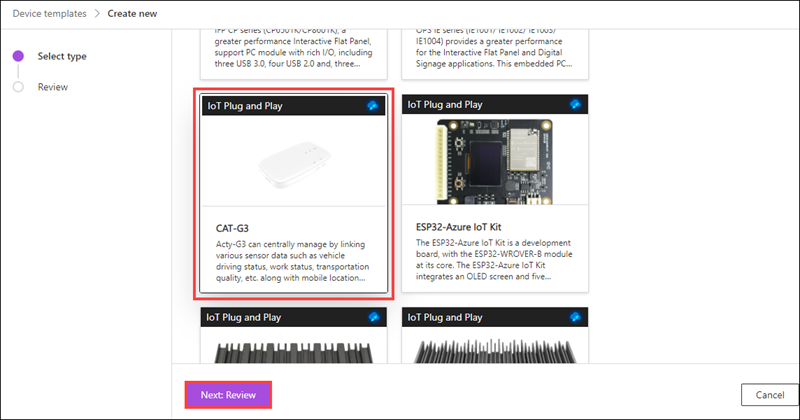
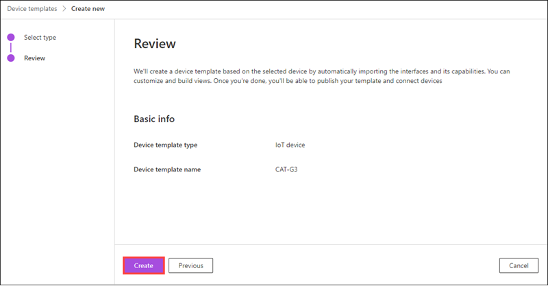
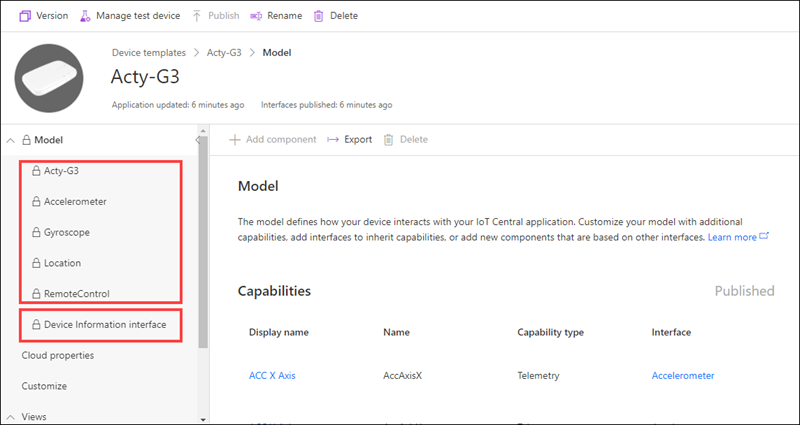
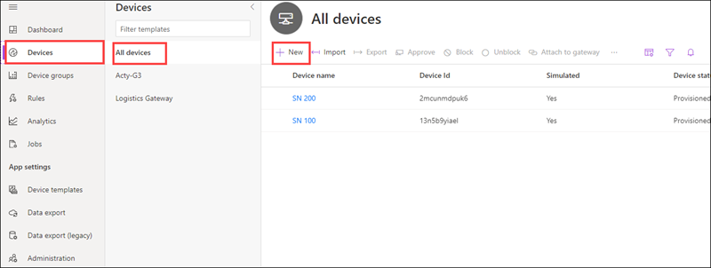
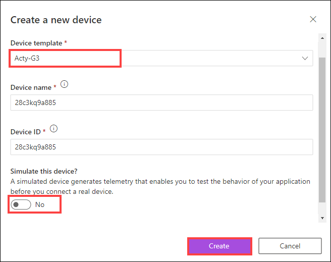
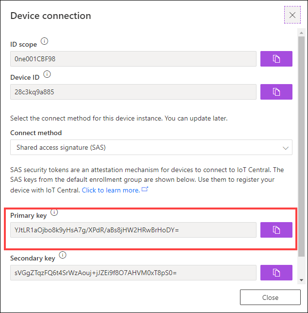
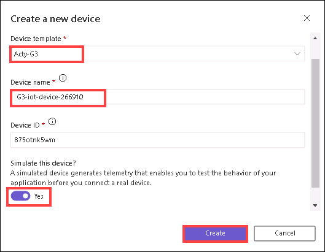
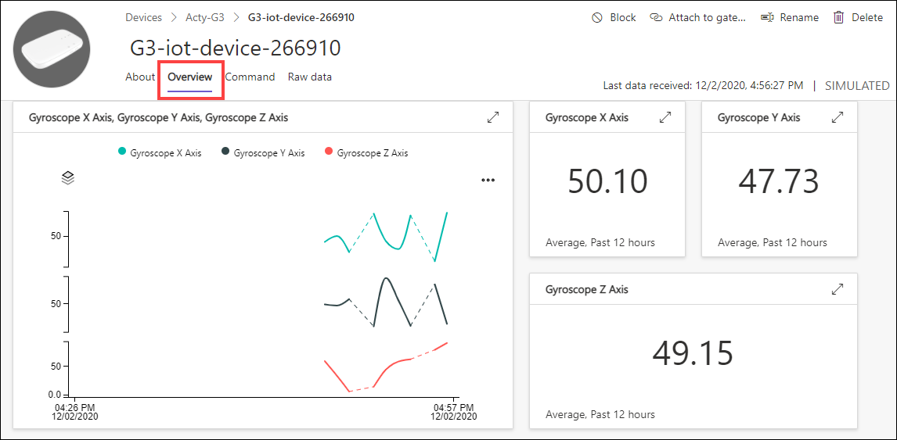
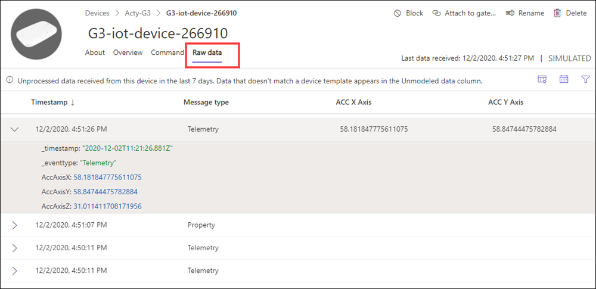

# Exercise 3: Connect IoT Plug and Play Certified Devices

## Overview

In this exercise, you will connect an IoT Plug and play certified devices to your application

This exercise includes the following tasks:

 - Import device capability model from Azure IoT Device Catalog (IoT Plug and Play Device) 
 
 - Retrieve Application Connection details to connect a device 
 
 - Add a simulated Device to the application 
 
 - View Simulated Data
 

### Task 1: Import device capability model from Azure IoT Device Catalog (IoT Plug and Play Device) 

IoT Plug and Play enables solution builders to integrate smart devices with their solutions without any manual configuration. At the core of IoT Plug and Play, is a device model that a device uses to advertise its capabilities to an IoT Plug and Play-enabled application. This model is structured as a set of elements that define:

   -  Properties that represent the read-only or writable state of a device or other entity. For example, a device serial number may be a read-only property and a target temperature on a thermostat may be a writable property.
   
   -  Telemetry that's the data emitted by a device, whether the data is a regular stream of sensor readings, an occasional error, or an information message.
   
   -  Commands that describe a function or operation that can be done on a device. For example, a command could reboot a gateway or take a picture using a remote camera.

In this task, you will import **IoT Plug and Play CAT-G3** pre-configured device template.

1. In your Connected logistics application page, from the left navigation menu, under **App settings** select **Device Templates**.

1. On the **Device Templates** page click on **+ New** to create a new template.

1. On the **Select template type** page, scroll down until you find the **IoT Plug and Play CAT-G3** tile.
 
1. Select the **IoT Plug and Play CAT-G3** tile, and then select **Next: Review**.

    

1. On the **Review** page, select **Create**.

    

1. The **IoT Plug and Play CAT-G3** capability model includes  model **Components** like **Location**, **Device Information Interface**. Device Information Interface define the capabilities of an CAT-G3 sensor device. Capabilities include the telemetry a device sends, the properties a device reports, and the commands a device responds to. You can explore through the other components available.

    
   
### Task 2: Retrieve Application Connection details to connect a device 

In this task, you will create a non-simulated device in the Azure IoT Central application, by using the device template which you added in the previous task and learn how to retrieve device connection details.

1. Now in your application page, from the left-hand menu navigate to **Devices**.
    
1. On the **Devices** page click on **+ New** to add a device.

    

1. In **Create a new device** page enter the following details:

      - **Template type**: Select **Acty-G3**.

      - **Device Name**: Enter a name for your device.

      - **Device ID**: Leave default.

      - **Simulate this device**: Turn the Simulated toggle to **Off**.
      
      Select **Create**.
      
      

1. On the **Devices** page click on your newly created device.

1. From the top navigation page click on **Connect**. 

   

1. You can use the **Device connection** details from here to connect to the device.

   

1. For now we will not use this method to connect to the device, as we don't have any physical device with us.

1. Now from the **All devices** page, select your newly created device and click on **Delete** to delete the device as we will not be using this device further in the lab.

   

### Task 3: Add a simulated Device to the application 

Simulated devices let you test the behavior of your application before you connect a real device. In this task, you will create a simulated device in the Azure IoT Central application, by using the device template which you added in the task1 of this exercise.

1. In your Connected logistics application page, from the left-hand menu, navigate to **Devices**.

1. On the **Devices** page click on **+ New** to add a device.

1. Now in **Create a new device** page enter the following details:

      - **Template type**: Select **Acty-G3**.

      - **Device Name**: Enter a name for your device.

      - **Device ID**: Leave default.

      - **Simulate this device**: Turn the Simulated toggle to **YES**.
      
      Select **Create**.
      
      
      
#### Task 4: View Simulated Data

In this task, you will explore through data simulated by the newly added device

1. On the **Devices** page click on your newly created device.

1. Click on **Overview**. The **Overview** page shows a plot of the simulated telemetry. 

   > **Note**: It might take a few minutes for the data to appear.

   

1. Now click on **Raw Data**. From here you can view the raw telemetry and property values sent by the device. This view is useful for debugging devices.

   
   
In this exercise, you have seen how you can connect an IoT Plug and Play Certified sensor device to your Microsoft Azure IoT Central application and manage the device as well as view the data from the Microsoft Azure IoT Central Application

